[TOC]

## Introduce

- 自制的计算机系统互联
- 软硬件、数据的共享
- client-server：客户服务器模型
  - 服务器的变化：硬盘-文件-数据库-应用
- peer-to-peer：对等通讯
  - QQ
  - wireless but not mobile
    - 无线的方式传入大山，再用有线的方式传入家家户户
- 先有远程网，再有局域网
  - 先有局域网的名字，再有远程网的名字
  - local area networks, wide area networks
- broadcast networks
  - broadcast links：广播式链路
    - 通信信道被网络所有机器共享，任何一台机器发出的包能被所有其他机器收到
    - 包的地址字段指定了预期的接收方
    - 例子：无线网络
    - 广播和组播
      - 所有机器都处理该包：地址字段中使用一个特殊的编码
      - 某组机器
  - point-to-point links：点到点链路
    - packet
    - 只有一个发送方和一个接收方，也称单播
- 网络尺度分类
  - internetwork：两个或多个网络的连接
- 个域网：Personal Area Network
  - bluetooth
  - RFID
- 局域网：Local Area Network
  - 适合安装电缆太麻烦的地方
  - 接入点（AP, Access Point）、无线路由器（wireless router）、基站（base station）
  - 沿用传统的线路测量速率
    - 1 Mbps = 1 000 000 bit/s
    - 1 Gbps = 1 000 000 000 bit/s
- 域域网：Metropolitan Area Network
  - 有线电视
- 广域网：Wide Area Network
  - host, subnet
  - 子网：把信息从一个主机带到另外一个主机
    - transmission line：负责在机器间移动比特
    - switch：负责两条或两条以上的传输线路
  - 广域网和局域网的区别
    - 广域网中，主机和子网由不同的人拥有和经营
    - 路由器通常连接不同类型的网络技术
    - 子网连接的东西不同
  - 广域网类型
    - VPN：Virtual Private Network
    - ISP network
- 互联网络：internetwork
  - 一组相互连接的网络

- 传输技术的类型
  - Broadcast links
  - Point-to-point links

### 参考模型：OSI

- 物理层
  - 建立在物理媒介基础之上，通过物理层实体的增强，向更高层即数据链路层提供面向二进制流的传输服务
  - 物理层不是物理媒介，物理媒介不在网络的体系结构里
  - 机械的、电气的、功能的、时序的问题
  - 传输的基本单位是bit
  - PH
- 数据链路层
  - 地理上直接相邻的两个结点之间，在物理层所提供的二进制流传输服务的基础之上，向网络层提供一个面向帧的、基本无错的、平滑的传输服务
  - 三件事情：
    - 帧的定界或帧的同步，或Framing 成帧
    - 擦除？操作控制
    - 流量控制
  - 传输的单位是帧
  - DL
- 网络层
  - 把一段一段的数据链路串接起来，使得任意的两个结点，不管是否直接相邻，它们都能够直接通信
  - 三个方面的工作：
    - 路由选择
    - 中继
    - 网络互联
  - 传输的单位是包
  - N
  - 路由器只到网络层为止，再往上就没有了
- 运输层（运输层开始都是主机的事情）
  - 传输单位是segment
  - 都是**端对端**的关系 end to end
    - peer-to-peer 对等关系
    - point-to-point 点对点
  - 是一个箩筐，把所有没地方放的东西都搁这
  - 用来弥补通信子网向网络应用所能够提供的服务和网络应用对于通信子网的需求之间的差距
  - 工作
    - 带宽
      - 带宽不够：做多个链接支持这一个链接
    - 可靠性
      - 下三层可靠性不够，可以通过进一步校验、多连接，增强可靠性
    - 涉及到下三层通信有关的问题都在这层处理掉
  - 完全涉及到主机
- 以上四层和通信比较直接相关
- 会话层
  - 单工：只能走一个方向
  - 双工
    - 全双工
    - 半双工：两个方向都能走，但不能同时
  - 打电话：电路是全双工，本质是半双工（按照半双工使用）
  - 同步管理（下载时网络中途死掉）
- 表示层
  - 抽象语法与传送语法的转换
  - 传送语法：翻译与翻译之间
  - 抽象语法：某一边与翻译之间
  - 大小端问题的传输
    - 大端 低地址放高位 RISC
    - x86小端
- 应用层
  - 向网络应用提供一种通用的服务
  - 实际上最上面三层可以合并
  - 不是网络应用本身，网络应用不属于网络的体系结构
  - http，ftp等协议

### 网络的体系结构

- IBM提出的第一个网络体系结构
  - 系统网络结构 System Network Architecture：SNA
- DEC：DNA
- OSI
- TCP/IP

- 打电话：450Hz
- 一秒通，四秒断

### Protocol Hierachies

- procedure 规程 / protocol
- 垂直的方向
  - interface 涉及到实现 / service 涉及到抽象、逻辑的

- 网络层：要做路由选择，上面要明确告诉我说M要给谁
  - M里面没有ip地址，要加上
- 表示层：大端小端？
- overhead / payload
- H / T：head / tail
- 分成两个包：
  - 误码率
  - 包不能太大：与误码率有关
- 路由器：边收边转（直通）
  - 带来问题：需要校验
  - 因此需要有些overhead放在尾巴

**遇到的问题**

- 寻址
  - 网络层：ip地址
  - 数据链路层：网卡地址
- 擦除控制
- 流量控制
- 多路、反多路 Multiplexing
- 路由 Routing

**Connection-Oriented and Connectionless Services**

- 电话和邮政
  - 电话是面向连接的模型
    - 三个阶段：连接的建立、数据通信、连接释放
    - 传输的数据在同一根线上
    - 天然有顺序
  - 邮政是无连接的模型
    - 直接就是数据通信
    - 连续寄两封信
    - 顺序没有保证，只能由应用层次解决
    - 单独的寻址

- ip是无连接的协议
- tcp是面向连接的：可靠性好，实时性不好

### 参考模型

- OSI
  - DU：Data Unit
- TCP/IP
  - 最早没结构，后来才搭的
  - 
  - IP：是一个协议，是互联网上网络层的一个协议
  - TCP：运输层最重要的一个协议
  - 指的是一箩筐协议
- 比较
  - OSI的模型是失败的：
    - 建不出来：好多协议都没有制定出来
    - 协议有，但没有软件
  - Why OSI did not take over the world
    - Bad timing
    - Bad technology
    - Bad implementations
    - Bad politics
    - 时间上失败：标准的制定应该在研发和投资之间
  - OSI比较好的地方：
    - 抽象正确，五六七没必要分
    - 这三个术语好：Services, Interfaces, Protocols
  - TCP/IP：协议都有，软件都有

### 网络的例子

- The ARPANET
  - 世界上的第一个计算机网络
  - 远程网，网状网
  - IMP：接口信息处理机
- Internet
  - 无中心、有层次
- 以太网
- Wifi：无线局域网
- RFID：射频芯片

### 谁制定的标准

- RFC Request For Comments 因特网标准的形式

  

- ISO 国际标准化组织：OSI参考模型、HDLC协议

- ITU 国际电信联盟：制定通信规则

- IEEE：IEEE802系列标准、5G

### 度量单位

- kbps：kilobites/sec 千位每秒
  - kbps, Mbps, Gbps, Tbps
  - 3, 6, 9, 12
- m代表milli $(10^{-3})$，μ代表micro $(10^{-6})$

## The Physical Layer

- 物理层就是在物理媒介的基础之上，在两个相邻的结点之间提供一个面向二进制流的传输服务

- **中继器和集线器**

- 物理层不包含具体的传输媒体（第0层）

- 物理层任务：确认与传输媒体接口有关的一些特性

  - 机械特性（引线数目，引脚数目）、电气特性（电压范围、传输速率与距离）
  - 功能特性（**某一电平表示什么意义**）、规程特性（**定义各条物理线路的工作规程和时序关系**）

- 调制解调器

  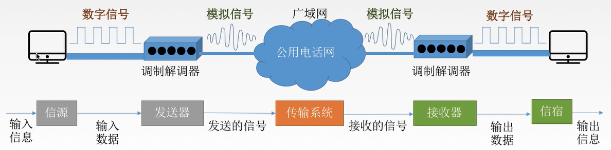

  - 通过电话线入网：电话线传输模拟信号，网卡出来是数字信号
  - 调制 Modulator：把数字信号转换成模拟信号

- 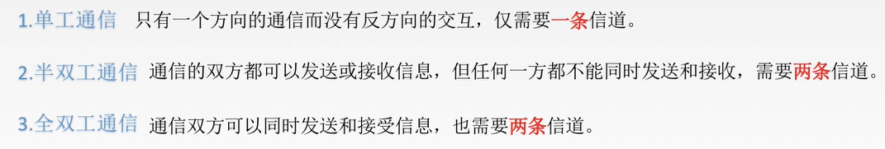

### 1. 数据通信的理论基础

- 任何一个信号都可以做一个傅里叶变换，得到直流分量和一系列的交流分量

- 码元

  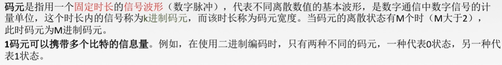

- 速率可以用码元传输速率和信息传输速率

  - 码元传输速率：1 Baud表示每秒传输一个码元

- 信道带宽：最高频率 - 最低频率

#### 傅里叶分析

#### 带宽有限的信号

- 传输设施对不同傅里叶分量（这些分量频率不同）的衰减程度不同

- 对导线而言，$$0$$到某个频率$$f_c$$的这段范围内，振幅在传输过程中不衰减，而后所有频率的振幅都会有**不同程度**的减弱

- bandwidth 带宽

  - **在传输过程中振幅不会明显减弱的频率的宽度**
  - 实际上截止频率没有那么明显，通常指0到接收能量保留一半的频率位置

- baseband 基带信号

  - 从0到某个最大频率的信号

- passband 通带信号

  - 被搬移并占用某个更大频率范围的信号

- 

- 最大谐波数计算

  

  - 第一个谐波频率即对应函数的周期T，发送8个比特为一个周期
  - 第二个谐波的频率是第一个谐波频率的2倍，第三个是3倍，第n个是n倍
  - 因此用3000除以第一个谐波的频率即可

- 数据传输速率的对应关系（400*->2400）

  

  - 如果想要在**语音级**电话线上有9600bps的速率，那么只能有两个谐波
    - 见上面的图，两个谐波实际上是无法还原信号的
  - 即使传输设备没有噪声，也不可能以高于38.4 kbs的数据速率传输任何二进制信号
  - **限制了带宽也就限制了数据传输率**

- 模拟带宽和数字带宽

  - 模拟带宽以赫兹度量：和上面所述一致 Hz
  - 数字带宽：一个信道的最大数据速率，每秒多少个比特 bps

#### 信道的最大数据速率

##### Nyquist：有限带宽的无噪声信道的最大数据传输率

- 注意例子是两级

- 理解每秒2B次采样：即高于每秒2B次的采样没用，最大只能采2B次
  
  - V个离散等级：代表每次采样确认了$log_2V$个比特
  
- **在理想低通（无噪声，带宽受限）条件下，为了避免码间串扰，极限码元传输速率为**

  
2W Baud, W是信号带宽(Hz)

  - 只对码元传输速率的限制，没有对信息传输速率给出限制

  

  - 有16种码元（4*4），最大传输速率2\*3k\*4 = 24kb/s

##### Shannon：扩展到有随机噪声的信道的情形

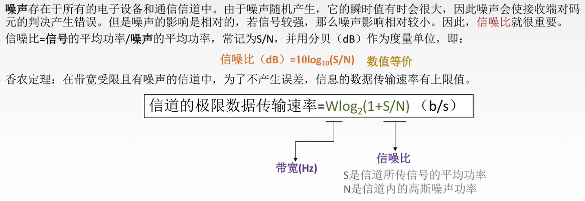

- **信噪比** (SNR Signal-to-Noise Ratio)
  - 度量热噪声（随机噪声）的数量：信号功率和噪声功率的比值
  - 信号功率记作S，噪声功率记作N
  - 分贝：$10log_{10}S/N$
    - 10的信噪比为10分贝，100的信噪比为20分贝

- 

#### 编码与调制

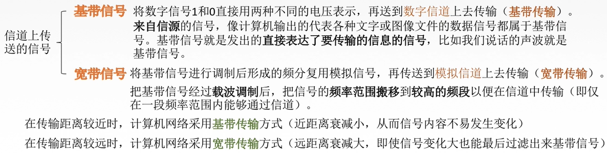

- 基带信号：发出的直接表达了要传输的信息的信号

  - 可以是数字的或模拟的
  - 但是计算机网络中用的是数字的，网卡发出的是数字信号，放到数字信道上传输（基带传输）

- 宽带信号：将基带信号进行调制后形成的频分复用模拟信号，再传送到模拟信道上去传输

- 基带传输是一种不搬移基带信号频谱的传输方式，未对载波调制的待传信号称为基带信号，它所占的频带称为基带，基带的高限频率与低限频率之比通常远大于1

  将基带信号的频谱搬移到较高的频带（用基带信号对载波进行调制）再传输，则称为通带传输

- 书上定义：

  - 基带传输：信号的传输占有传输介质上从0到最大值之间的全部频率
  - 通带传输：信号占据了以载波信号频率为中心得一段频带

------

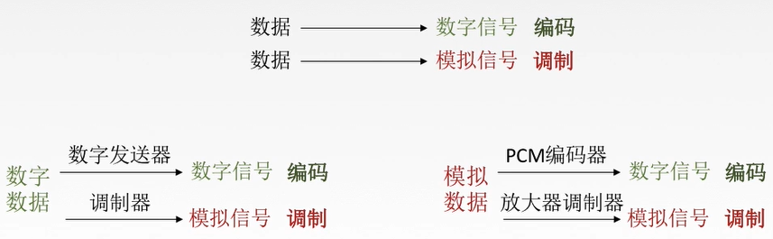

- 模拟数据 -> 模拟信号：低频信号调制成高频的信号

##### 数字数据编码为数字信号

- 非归零编码 NRZ
  - 高1低0，难以保持同步
  - 尼奎斯特定律：至少B/2 Hz的带宽才能获得B bps的比特率
  - 一长传的0和1时存在时钟恢复问题
- **不归零逆转 NRZI**
  - 1为信号有跳变，0为信号无跳变
  - 长串1没有时钟恢复问题，0有问题
  - USB采用NRZI编码方式
- 4B/5B
  - 每4个比特流被映射成一个5比特模式
  - 不会有超过3个连续的0
  - 额外收获：用非数据代码组合表示物理层的控制信号（线路空闲，帧的开始）

- 曼彻斯特编码
  - 先高后低是1
  - 1个slot中变化了两次，但比特只传了1位

- 差分曼彻斯特编码
  - 前半个码元的电平与上一个码元的后半个码元相同，则为1
  - 抗干扰性：差分强于曼彻斯特（算法更复杂）

##### 数字数据调制为模拟信号

- 调制：数字信号转换为模拟信号

- 调幅：0无幅度，1有幅度
- 调频：0频率低，1频率高
- 调相：0对应一种波形，1对应另一种波形（正弦波或余弦波）
- QAM：调幅 + 调相
  - 正交调幅
  - QAM-64：每个符号传输6个比特

- 一个点的相位是角度，一个点的振幅是该点到原点的距离

##### 模拟数据编码为数字信号

- 音频数字化，脉冲编码调制
- 对音频信号进行编码的脉码调制（**PCM**）

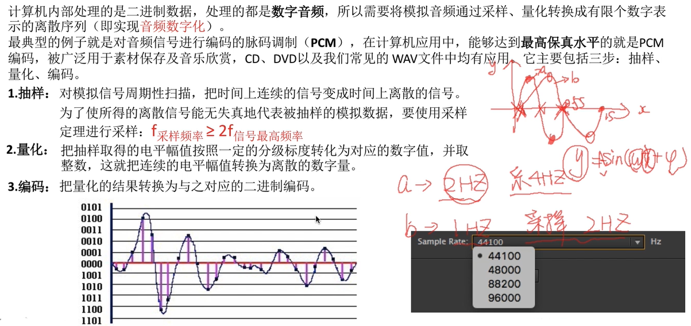

##### 模拟数据调制为模拟信号

- 为了实现传输的有效性，可能需要较高的频率
- 还可以使用频分复用技术，充分利用带宽
- 在电话机和本地交换机所传输的信号是采用模拟信号传输模拟数据的方式

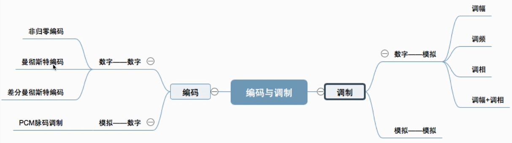

#### 传输介质

- 传输媒体并不是物理层：第0层
  - 物理层规定了电气特性

##### 引导性传输介质

- 双绞线

  - 两根采用一定规则并排绞合的、**互相绝缘**的铜导线组成
  - 绞合可以减少相邻导线的电磁干扰
  - **模拟传输**：要用**放大器**放大衰减的信号
  - **数字传输**：要用**中继器**将失真的信号整形

- 同轴电缆

  - 外导体屏蔽层：抗干扰性比双绞线更强
  - 传输距离更远
  - 价格更贵

- 光纤

  - 纤芯：高折射率
  - 传送超远距离

  

  - 多模光纤：可以射入多条光，适合近距离传输
  - 单模光纤：只能射入一条光

##### 非引导性传输介质

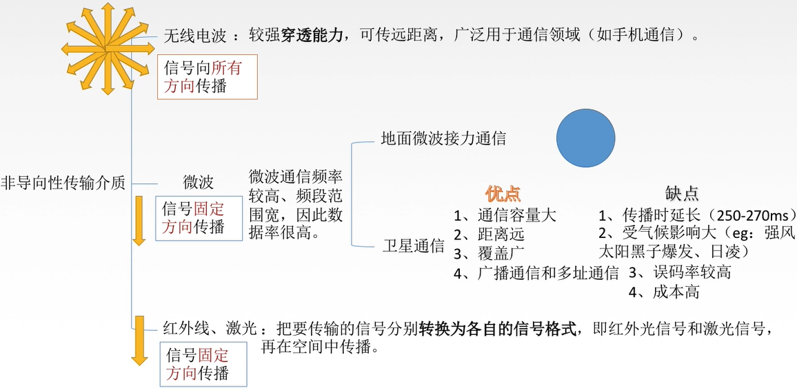

#### 物理层设备

##### 中继器

- 对信号进行再生和还原，对衰减的信号进行放大，保持与原数据相同，以增加信号传输距离
- **再生数字**信号
  - 对模拟信号有另外的：放大器
- 中继器两端的网段一定要是同一个协议
  - 中继器不会存储转发

##### 集线器（多口中继器）

- 对信号进行再生放大转发
- 转发至**除输入端口外**的其他端口
- 广播

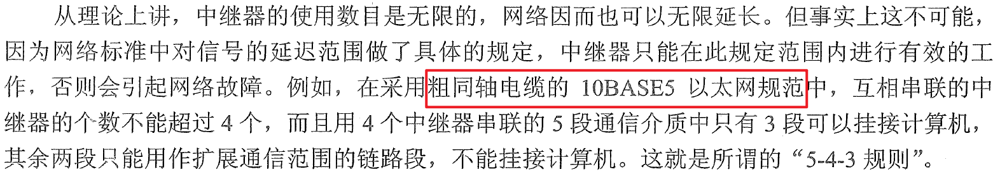

### 2. 引导性传输介质 Guided Transmission Media

#### Magnetic media

- 永远不要低估一辆满载着磁带在高速公路上飞驰的旅行车的带宽
- 延迟特性差，传输时间以分钟或小时计算

#### Twisted pairs 双绞线

- 两根互相绝缘的铜线绞在一起
  - 不同电线产生的干扰波会相互抵消，从而**降低电线的辐射**
- 信号通常以两根电线的电压差来承载
  - 对外部噪声有更好的免疫力（噪声对两根电线的干扰相同，不影响电压差）
- 应用在电话系统
  - 打电话和ADSL接入Internet都发生在双绞线
  - 距离很远，信号衰减厉害，就需要中继器
  - 许多双绞线并行时，需要把它们捆成一束
    - 否则会互相干扰
- 用于**传输模拟和数字信号**
  - 带宽取决于导线的直径、距离远近
  - 传输性能足够，成本低
- 5类线（Category 5）
  - 4对双绞线套在一起

- 链路分类
  - 全双工 full-duplex：双向同时使用
  - 半双工 half-duplex：一次只能使用一个方向
  - 单工 simplex：只允许一个方向上传输

#### Coaxial cable 同轴电缆

- **比非屏蔽双绞线有更好的屏蔽特性、有更大的带宽**
  - 高带宽、很好的抗噪性
- 两种广泛使用
  - 50Ω 电缆：**数字传输**
  - 75Ω 电缆：**模拟传输和有线电视传输**
- **铜芯**、绝缘材料、**编织外层导体**、保护塑料外套

#### Power lines 电力线

- 数据信号和电源信号同时使用电线
  - 数据信号叠加在低频电力信号上
- 困难：电线是专为分发电源信号设计的
  - 分发电能和分发数据信号是不同的
  - 电信号以50-60Hz的频率发送，而高速率数据通信需要MHz的频率，在电线上会发生严重衰减
  - 电线的电气特性并不是户户相同
    - 电器设备开关时，产生瞬态电流，产生宽频率范围的电噪声

#### Fiber optics

- 光纤传输系统
  - 光源
  - 传输介质：超薄玻璃纤维
  - 探测器：探测到光时产生一个电脉冲，表示比特1
- 入射角大于临界角，产生全反射
  - 多模光纤 multimode fiber
    - 许多不同的光束以不同的角度来回反射着向前传播
  - 单模光纤 single-mode fiber（昂贵）
    - 光纤直径只有几个光波波长
    - 光只能按直线传播而不会反射
    - **长距离传输**
- 光的衰减
  - **取决于光的波长**（以及玻璃某些物理特性）
  - 定义：输入和输出信号功率的比值
    - 如果损失了一半的能力，则衰减为$10log_{10}2 = 3$分贝
    - 衰减 Attenuation dB/km
    - 常用的三个波段：0.85、1.30、1.55微米

##### Fiber Cables 光缆

- 材料的折射率越高，使入射光发生折射的能力越强
- 玻璃芯、玻璃包套、塑料封套

- 玻璃覆盖层的折射率比玻璃芯低，保证所有的光被限制在玻璃芯内
- **两种光源：发光二极管LED和半导体激光**
  - 单模：多应用于长距离传输
  - minor / substantial

- 光纤的接收端：光电二极管
  - 遇到光照，发出一个电脉冲
  - 光电二极管的响应时间，即把**光信号转换成电域所需要的时间**
    - 限制了数据传输率在 100Gbps 左右

#### 光纤与铜线

- 光纤
  - 更高的带宽
  - 较低的衰减：50km才需要一个中继器，而铜线5km
  - 光纤不受电磁干扰、电源故障等，不受化学物质侵蚀
    - **用于恶劣的工业环境**
  - 轻，细小
  - 工程要求高，容易折断
  - 光纤接口的成本高

### 3. 无线传输 Wireless Transmission

#### The Electromagnetic Spectrum 电磁频谱

- 在铜线或光纤中，**电磁波的速度大约为2/3光速，且和频率有关**
- **λf = c**，c为真空中光速1
- 紫外线、X射线、γ射线
  - 频率高，但很难产生和调制
  - 穿透力不好，生物有害
  - UV：紫外线
- LF, MF, HF：低、中、高频
  - VHF：Very
  - UHF, SHF, EHF, THF：P83，pdf第97页

- 大多数信息传输使用相对窄的频段
- 三种使用较宽频段的方式**(?)**
  - 跳频扩频 frequency hopping spread spectrum
    - 发射器以每秒几百次的速率从一个频率跳到另一个频率
  - 直接序列扩频 direct sequence spread spectrum
    - 码分多址 CDMA Code Division Multiple Access
      - 信号被赋予不同的码片
      - CDMA构成了3G移动电话网络的基础
      - 还用于全球定位系统GPS
  - 超宽带通信 UWB Ultra-WideBand

#### Radio Transmission 无线电传输

- 传输距离长，容易穿透建筑物
  - 理解：波动性更强
- VLF, LF, and MF bands(波段)
  - 无线电沿着地面传播
  - 较低频率，可以在很远的地方被检测到
  - 容易穿透建筑物
  - 主要问题在于带宽太低

- HF, VHF band
  - 地面波被地球表面吸收
  - Ionosphere：电离层，电磁波被电离层折射回地球
  - 可以使用这些波段进行长距离通话

#### Microwave Transmission 微波通信

- 100MHz：$10^8$以上频段，电磁波几乎按直线传播
  - 抛物线状天线作用下，被聚集成窄窄的一束 --> 获得**极高的信噪比**
  - 要求发射端和接收端的天线必须精准地互相对齐
- 微波按直线传播
  - 微波塔之间太远，地球本身会阻挡
  - 因此需要中继器
- 低频无线电波可以穿透，但微波不能很好地穿透建筑物
- 多径衰落 multipath fading
  - 有些微波被过低地大气层折射回来，比直接波传得更远
  - 延迟抵达的微波和直接传输的微波相位不同，可能抵消

#### The Politics of the Electromagnetic Spectrum

- 不分配频率的方式，但对功率进行控制
  - 使得发射台只能在很短的距离工作，而不会和其他用户产生干扰
- ISM：Industrial, Scientific, Medical
  - 把这些频段保留下来用于非许可性应用
  - 限制发射功率
- U-NII：Unlicensed National Information Infrastructure
  - 非许可的国家信息基础设施

#### Infrared Transmission 红外传输

- 短程通信：遥控器
- 具有方向性，不能穿过固体物体
- 红外系统的防窃听安全性好

#### Light Transmission

- 非引导性的光学链路必须具备足够的容错工程设计

### 4. 通信卫星 Communication Satellites

- 静止轨道或深空探测：延迟特别大
  - 极大地影响了通信协议
  - 每秒钟传输的比特数和电路的总的延迟相乘
    - 这个乘积比较大 --> 胖管道

- Van Allen belts：受地球磁场影响的一些高带电粒子层，卫星在这会毁坏

- 安全放置卫星的三个区域：
  - GEO：Geostationary Earth Orbit 地球静止轨道卫星
  - MEO：Medium 
    - 每6小时绕一圈，因此需要对它们的轨迹进行跟踪
    - 目前只用于导航，不用于通信
    - **MEO最大应用实例**：20200 km 的轨道上有30颗**全球定位系统**GPS卫星
  - LEO：Low
    - 铱星 Iridium
      - 发射77颗低轨道卫星，提供通信服务
      - 需要在卫星之间中继呼叫，因此卫星上需要装备复杂的交换设备
    - 全球星 Globalstar
      - 48颗LEO卫星
      - 把大量的复杂性放在地面，容易管理
      - 可以接受微弱信号，发出强的信号，从而可以使用低功耗的电话
      - bent-pipe satellite

### 5. 数字调制与多路复用 Digital Modulation and Multiplexing

- 异步通信和同步通信
  - 异步通信：以字符或字节为单位，每个字符同步一次
    - 效率低：加起始位、终止位
  - 同步通信：
    - 钟得一样，怕偏移积累
- **数字调制 digital modulation**：比特与代表它们的信号之间的转换过程
- 基带传输
  - 信号的传输占有传输介质上从0到最大值之间的全部频率
  - 有线介质
- 通带传输
  - 以载波信号频率为中心得一段频带
  - 无线、光纤信道，因为这样的传输介质中只能在给定频带传输信号
- **多路复用 multiplexing**：信道被多个信号共享

#### Baseband Transmission

- NRZI：有转变表示1，没转变表示0
- 曼彻斯特编码：高到低是1，低到高是0
- bipolar 二极编码：正负为1，0是0
  - 一定时间内，DC分量接近于0，容易被歪曲，抗干扰性会好
- 时钟恢复的问题
  - NRZ的方式
    - 多次发送0后，不知道是15个0还是16个0
  - 曼彻斯特编码解决时钟恢复的问题
    - 把时钟信号编码到信号里了，多少次transition就是多少个bit
    - S：symbol rate，曼彻斯特编码时两个symbol表示一个比特
    - 因此曼彻斯特编码的带宽利用比较低，最大数据传输率减半了

- 
  - 符号率即波特率
  - 比特率 = 符号率 * 每个符号比特数
  - 信号级别不一定非是2的幂次：某些信号级用来防止出错、简化接收器设计

- 很多个 0 ？ --> **4B/5B**
  - 每4个比特映射成5个比特
  - 不会有连续的3个0
  - 共$2^4=16$
  - 
  - 可以用一些没用上的映射作为物理层的控制信号
    - 11111表示线路空闲，11000表示一个帧的开始

#### Passband Transmission

- 不能拉线，用电话网，弄掉电话机，但有障碍
- 交换机和交换机之间的中继线有限制
  - 为了复用的目的，每一对电话提供4000Hz的带宽
  - 基带信号传不了
  - 人打电话，4000Hz足以识别打电话讲话，但是数据通信不够
- 利用振幅
  - 对基带信号调制
  - 希望传输1的时候，载波频率一般会比较高，4000Hz以内就行
  - 一般300-3400Hz之间，因为其他会保护，防止串应用
  - 振幅代表基带信号 --> 调幅 AM Amplitude Modulation
- 利用频率
  - 通过频率表示0 1
  - 调频 FM Frequency Modulation
- 利用相位
  - 调相 PM phase modulation
- 可以用多个频率、多个相位等等
- 一般会用两个手段进行调制
- 数点的个数：即一次发多少比特

- 

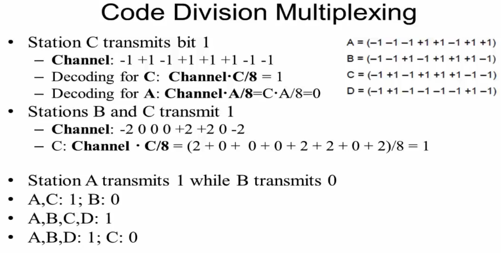

- 解码出来是0的话，代表没有发送数据

### 6. The Public Switched Telephone Network

- 必须依赖已有的电信设施来建设网络
- PSTN 公共交换电话网络
  - 传输人声
- PSTN的不足：
  - 两台计算机之间的cable可以达到$10^9 bps$或更多，而电话线至多$56kbps$
  - 对于combined bit rate times error performance，计算机cable比电话线好11个数量级

#### 电话系统的结构

- 一开始出现的形式是一对一对电话的
- 而后出现层次关系，共5个levels
  - end office(本地局), toll office(长途局), primary office(初级局),
    sectional office(地区局), and regional office(区域局)

- 电话系统的三个主要部分

  - local loops：用户和switching office之间的线
    - **Analog twisted pairs** going to houses and businesses (not open loop).
  - **Trunks** **干线**：switching offices之间的长距离关联
    - **Digital fiber optics** connecting the switching offices (**used to be coaxial cables**).
  - Switching offices
    - to switch calls from one trunk to another (manual operators + jumpers -> automatic switching computer).

- 两种打电话的方式

  - 如果双方连接在同一个end office，直接在两个local loops上建立直接的electrical connection

  - 不同的end office

    

#### Politics

- LATA：local access and transport areas 本地访问和传输区域
  - 全美分成164个LATA
- LEC：local exchange carrier 市话电信局
  - 在一个LATA内，有一个LEC，垄断电话服务
- IXC：IntereXchange Carrier 长话电话局
  - LATA之间的交通

#### Local loop

##### Modems：Dial-up modems

- 打电话线拆了接到modem上
- 上网的时候不能打电话
- 速率很低，只有56 kbps
- 模拟和数字的转换由modems和codecs完成
  - **modems：modulator, demodulator 调制解调器**
  - **codecs：coder, decoder 编码解码器**

- 模拟和数字
- 在3000Hz的**voice-grade line**上工作
- The Nyquist theorem says that even with a perfect 3000Hz line, there is no point in sampling faster than 6000Hz. **Max symbol rate = 2H**
- In practice, most modems sample 2400 symbols/sec and **focus on getting more bits per symbol.**
- **V.32 modem standard使用32个星座点，每个symbol传输4个数据比特和一个check bit，以2400的波特率传输，从而达到9600bps with error correction**
- 最终的V.90和V.92标准，提供**56-kbps**的**下行信道**

##### DSL：ADSL (Asymmetric Digital Subscriber Line)

- 上网的时候可以打电话
- 速度变快，电话线至多56kbps -> **xDSL(Digital Subscriber Line)**
  - **ADSL（Asymmetric DSL）**有代表性的技术
  - ADSL称为非对称：下行链路更宽
- 对xDSL来说，带宽更宽

- 原来的电话线上有人工引入的截止频率，大概3000Hz
- 现在把人工引入的截至频率（3000Hz）去掉，换句话说，本身电话线上能够传输的频率范围是比较宽的，我们把这个带宽全部利用起来
- 语音级电话线上的带宽**分成256个channel，每个4-kHz**
  - 第一个预留给Voice，对传输语音没影响
  - 四个给Upstream，剩下都给Downstream
- xDSL的设计目的
  - 向后兼容性：在现存的twisted pair local loops上工作
  - 不会影响电话和传真
  - 速度要比**56kbps**快
  - They should be always on, with just a monthly charge but no per minute charge.
- 典型ADSL架构

- - Splitter：语音分离器，在接入和发送端分离高频信号和语音信号

  - NID：Network Interface Device
  - DSLAM：DSL Access Multiplexor
  - ISP：Internet Service Provider

##### Fiber：FttH

- 光纤到户

#### Trunks 干线

- 特征
  - 传送数字信息即比特而不是声音，在end office需要进行转换
  - 多个电话共享一根中继线
    - 高宽带中继线的共享通过TDM和FDM多路复用方法实现

##### 数字化语音信号

- 模拟信号在end office被**codec**（coder-decoder）数字化
  - 语音信号是模拟的，然后要被数字化
  - The codec makes 8000 samples per second (125usec/sample)
    - 每个sample用125微秒
  - Each sample of the amplitude of the signal is quantized to an 8 bit number
  - **PCM (Pulse Code Modulation, 脉冲编码调制)**
- 根据尼奎斯特定理，这个采样率足以捕捉一切来自4kHz电话信道带宽上的信息
- 每个信号的样值幅度被量化成一个8比特的数字
- PCM是现代电话系统的核心
  - 几乎电话系统内所有时间间隔均为125微秒的倍数

##### Time Division Multiplexing 时分多路复用 TDM

- 电话公司设计schemes for multiplexing many conversions over a signle physical trunk

- 在PCM基础上，TDM可在中继线上运送多路电话语音，每125微秒为每路电话发送一个语音样值(sample)

- 也就是说，对于每一个语音信道，它每125微秒传一个sample（8bit）；而可以用时分多路复用把很多个语音信道复用

- T1 carrier

  - 193个比特
  - 第一个比特是framing code
  - 每个channel的最后一个比特用来作signal，7个是真正传数据的
  - 包含24条被复用在一起的语音信道，每个信道依次将8比特的样值插入到输出流

  

- 允许将多个T1载波复用到一个更高阶的载波

  - 4个1.544Mbps的T1流应该产生6.176Mbps，但T2实际是6.312Mbps
  - 多出来的比特用于成帧，或当载波失去同步时的恢复

  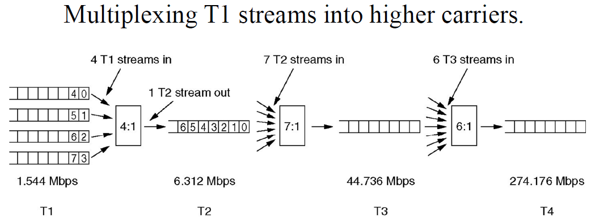

##### SONET/SDH 同步光纤网络/同步数字分级结构

- 光纤TDM系统的标准
- 两个标准，小部分不一样

- 用来协调网络层的参数，在trunk上形成标准

- SONET Synchronous Optical NETwork 同步光纤网络

- SDH Synchronous Digital Hierarchy 同步数字分级结构

- SONET帧：每125微秒发送**810字节**的数据块（是字节！）

  - SONET是同步系统，因此不管是否有有用的数据，这个帧都需要被发送
  - 每秒8000帧（刚好符合数字电话系统中使用的PCM信道的采样率）
  - 9行90列，每秒传输8000次，每次 8 * 810 = 6480 比特，总传输速率为51.84Mbps

- 格式

  

  - 每125微秒一个frame
  - 前三列：传输系统管理信息
    - **其中的**前三行：**段开销**
    - 接下来的六行：**线路开销**
  - 剩下的87列：**SPE** 同步有效载荷信封 Synchronous Payload Envelope
    - 包含了用户数据，还有其他一些开销
    - 由线路开销的第一行指定开始的位置
    - 第一列是路径开销，剩下86列是用来真正传输用户数据的
  - 

##### Wavelength Division Multiplexing 波分多路复用

- 在不同的波长范围传输

##### Switching

- Circuit switching
  - 过去需要接线员来连接线路，形成物理连接
- Packet
  - 每个包可以独立路由，都带着目的地的地址
  - 不需要首先建立连接

- 存储-转发传输